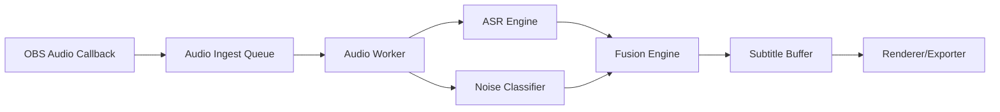

# MultiSub Architecture

## Overview

MultiSub runs as an OBS filter with low-latency callback ingestion and background processing workers.

## Runtime Components

- `MultiSubFilter`: OBS-facing lifecycle and callback adapter.
- `AudioEngine`: threaded queue + model wrappers for speech and events.
- `FusionEngine`: merges candidate outputs into subtitle events.
- `SubtitleBuffer`: bounded in-memory queue for newest subtitle records.
- `Renderer`: output path for OBS overlays/exporters (stub in current phase).

## Timing Strategy

- OBS callbacks enqueue lightweight metadata and optional mono samples.
- Worker thread processes batches outside callback thread.
- Fusion windows are bounded by configurable latency budget.

Current implementation uses placeholder inference logic to validate threading and interfaces before integrating ONNX Runtime.

## Extensibility

- Vision modules are isolated behind engine interfaces.
- Fusion policy supports adding modalities without changing OBS callback code.
- Subtitle event model can target both on-screen rendering and file export.
